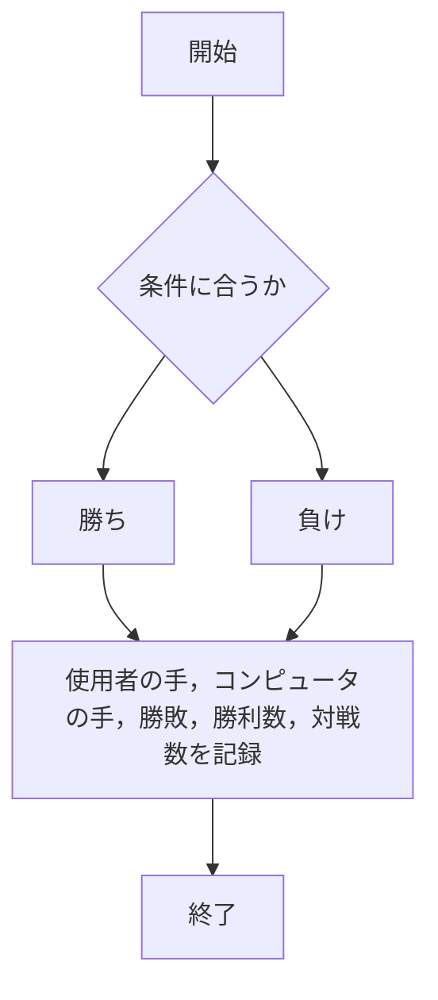
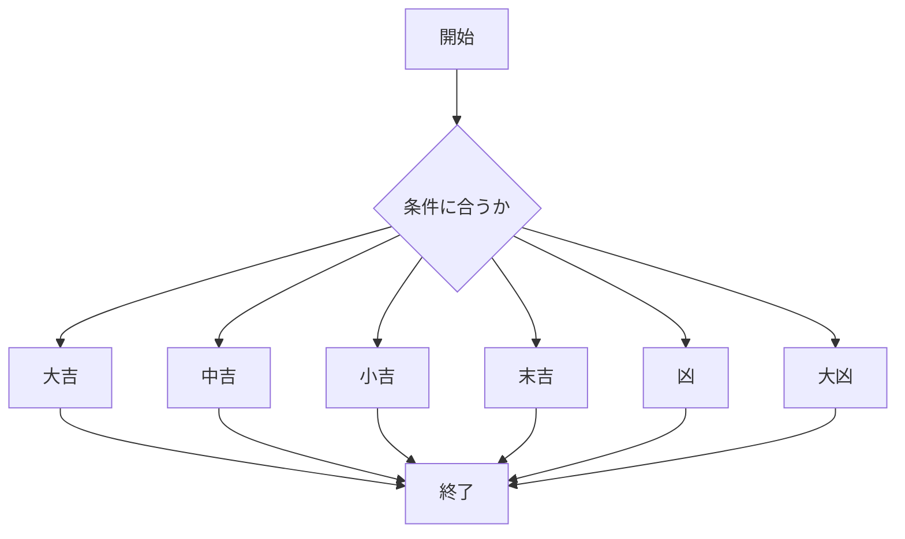
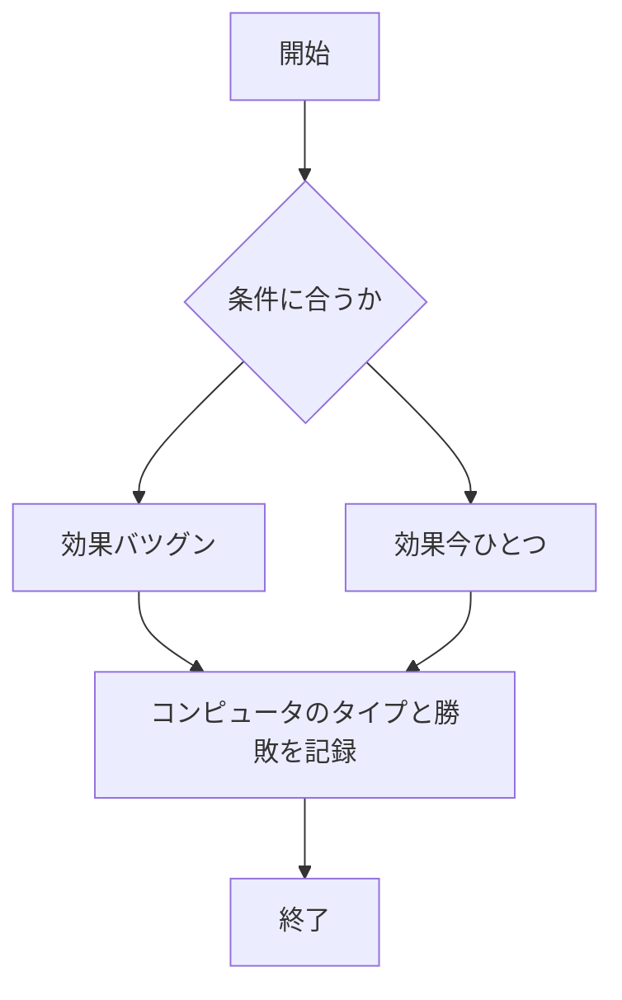

# webpro_06

## このプログラムについて
app5.jsに以下の3つのプログラムを追加した
1. /janken
1. /omikuji
1. /pokemon


## ファイル一覧
ファイル名|説明
-|-
app5.js | プログラム
public/janken.html | じゃんけんの開始画面
public/omikuji.html | 運勢占いの開始画面
public/pokemon.html | ポケモンタイプ相性の開始画面
views/janken.ejs | じゃんけんのテンプレートファイル
public/omikuji.ejs | 運勢占いのテンプレートファイル
public/pokemon.ejs | ポケモンタイプ相性のテンプレートファイル


## 機能の説明
### /janken
/jankenはグー，チョキ，パーの3つの手と乱数を用いてじゃんけんを行うプログラムである

以下に/jankenの作業を示す
1. どの手が選択されたか確認を行う
1. 1から3までの整数をランダムで生成し，コンピュータの手を決定する
1. 選択された手と生成された整数を用いて条件に基づいた勝敗を決定する
1. 使用者の手，コンピュータの手，勝敗，勝利数，対戦数を記録する



### /omikuji
/omikujiは選択されたラジオと乱数を用いて運勢占いを行うプログラムである

以下に/omikujiの作業を示す
1. どのラジオが選択されたか確認を行う
1. 1から6までの整数をランダムで生成する
1. 選択されたラジオと生成された整数を用いて条件に基づいた運勢を決定する



### /pokemon
/pokemonは選択されたラジオと乱数を用いてポケモンタイプ相性を判断するプログラムである

1. どのラジオが選択されたか確認を行う
1. 1から3までの整数をランダムで生成し，コンピュータのタイプを決定する
1. 選択された手と生成された整数を用いて条件に基づいたタイプ相性を決定する
1. 使用者の手，コンピュータのタイプ，勝敗を記録する



## 使用手順
### /janken

1. app5.js を起動する
1. Webブラウザでlocalhost:8080/public/janken.htmlにアクセスする
1. 自分の手を入力する

### /omikuji

1. app5.js を起動するlocalhost:8080/public/omikuji.html
1. Webブラウザでにアクセスする
1. 3つのラジオから1つ選択する

### /pokemon

1. app5.js を起動する
1. Webブラウザでlocalhost:8080/public/pokemon.htmlにアクセスする
1. 3つのラジオから1つ選択する

## Gitでの編集したファイルの管理
Gitで編集したファイルを管理するには以下の3つのコマンドを実行する必要がある
```
git add .
git commit -am '変更内容のコメント'
git push
```
