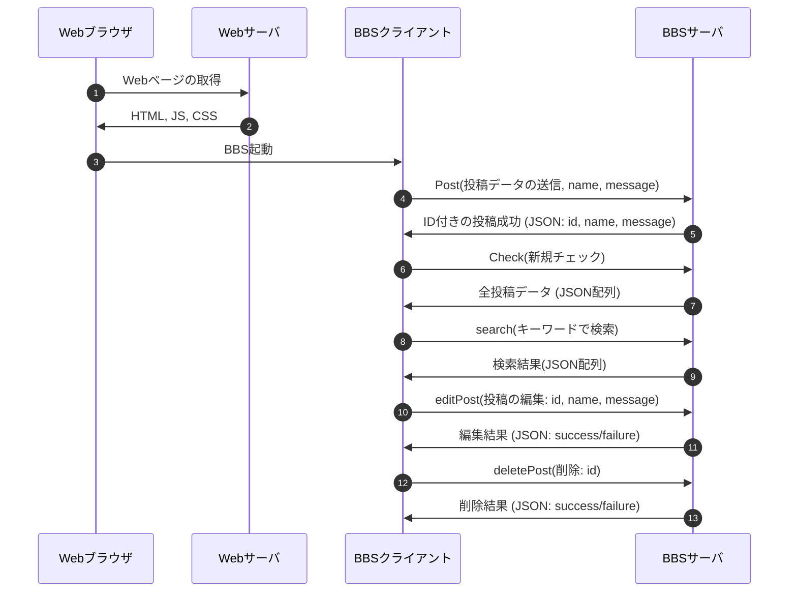

```mermaid
sequenceDiagram
  autonumber
  participant Webブラウザ
  participant Webサーバ
  participant BBSクライアント
  participant BBSサーバ
  
  Webブラウザ ->> Webサーバ: Webページの取得
  Webサーバ ->> Webブラウザ: HTML, JS, CSS
  Webブラウザ ->> BBSクライアント: BBS起動
  BBSクライアント ->> BBSサーバ: Post(投稿データの送信, name, message)
  BBSサーバ ->> BBSクライアント: ID付きの投稿成功 (JSON: id, name, message)
  BBSクライアント ->> BBSサーバ: Check(新規チェック)
  BBSサーバ ->> BBSクライアント: 全投稿データ (JSON配列)
  BBSクライアント ->> BBSサーバ: search(キーワードで検索)
  BBSサーバ ->> BBSクライアント: 検索結果(JSON配列)
  BBSクライアント ->> BBSサーバ: editPost(投稿の編集: id, name, message)
  BBSサーバ ->> BBSクライアント: 編集結果 (JSON: success/failure)
  BBSクライアント ->> BBSサーバ: deletePost(削除: id)
  BBSサーバ ->> BBSクライアント: 削除結果 (JSON: success/failure)
```